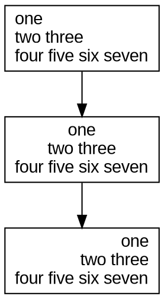

Regular **Markdown** here.

First diagramm as PlantUML:
<!--
@startuml firstDiagram

Alice -> Bob: Hello
Bob -> Alice: Hi!
	
@enduml
-->

Some more markdown.

Second diagram as GraphViz:
<!--

```dot
digraph L {

  node [shape=record fontname=Arial];

  a  [label="one\ltwo three\lfour five six seven\l"]
  b  [label="one\ntwo three\nfour five six seven"]
  c  [label="one\rtwo three\rfour five six seven\r"]

  a -> b -> c

}
```

